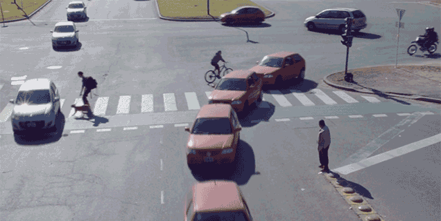

# 24AL733 - Connected Vehicles and Security 
   

## Connected Vehicles

### Definition
A Connected Vehicle is 
- a Smart Car
- a vehicle that can communicate with other vehicles
- a vehicle with internet connection and can communicate with internet

  

### Evolution through Connected Vehicles
- 1980: On-board Computer - BMW put an on-board computer into an F1 car. This passed vehicle data on to the box. 
- 1996: E-Call Functionality - In-built functionality that the vehicle could register an accident and automatically call the nearest emergency centre. General Motors introduces OnStar, created in partnership with Motorola Automotive.
- 1997: Smart Key Feature - First wireless keyfob introduced by Mercedes-benz for the W220 S-Class. The vehicle was made availble in 1998. 
- 1999: GPS - The use of GPS signals for civil and commercial applications was made possible by Mercedes-Benz, which launched TeleAid for stolen vehicles and roadside assist.  
- 2001: Remote-Controlled - With vehicle diagnostics, car manufacturers can examine the system’s functionality and, if there are any problems, potentially recognise the cause more quickly.
- 2004: SIM Cards - BWM started integrating SIM cards, drivers were able to access messages, the weather and office functions while online. 
- 2008: Smartphone Launch - Introduction of the iPhone and the first smartphone apps for connected cars. Chrysler became the first car company to use the Internet Hotspot feature
- 2009: Telematics - Mercedes-Benz launches mbrace, which allows owners to wirelessly lock and unlock their car doors via their iPhone or BlackBerry device.
- 2012: Car Connectivity MirrorLink - Allows drivers to operate selected smartphone apps via in-built infotainment systems. First Tesla Model S is introduced with 3G and over-the-air updates
- 2014: Car Connectivity CarPlay - Apple introduces CarPlay at the Geneva Motor Show. Audi begins to offer 4G hotspots and General Motors makes a mass deployment of 4G. 
- 2015: Remote Parking Pilot - Mercedes-Benz introduced app that allows drivers to control parking outside of their car via Bluetooth and a smartphone.
- 2018: ConnectedDrive - 4 million customers are connected to BMW’s ConnectedDrive services.

_Sources:_ [Compass IoT Global](https://www.compassiotglobal.com/ultimate-guide-to-connected-vehicles/part-1-background-on-connected-vehicles-and-connected-vehicle-data), [BMW - Connected Car and its History](https://www.bmw.com/en/innovation/connected-car.html#:~:text=The%20connected%20car%20in%20Formula,linked%20up%20with%20their%20environment.)

### Types of Vehicle Connectivity - Vehicle to Everything (V2X)
- **Vehicle to Vehicle (V2V)**
  - Warn other vehicles about
    -  difficult road conditions
  - Autonomous Driving
    - Vehicle pooling (trailing) 
- **Vehicle to Infrastructure (V2I)**
  - Send warnings to driver
    - sharp corners
    - breaking speed limits
    - heavy rain (weather updates)
  - Heavy vehicles
    - request for signal priority
  - Car parks
    - communicate about availablity of spaces
  - Traffic lights
    -  communicate length of their signal duration
- **Vehicle to Cloud (V2C)**
  - Modern Navigation System
  - Car Sharing Systems
  - Remote Diagnostics
  - OTA Updates
- **Vehicle to Pedestrian (V2P)**
  - Pedestrain Recognition and Warning System
    - PS: Pedestrain also include other vulnerable users like cyclists
    - alert about hazardous situation
    - A Smart Road Infrastructure is mandatory
- Vehicle to Device (V2D)
- Vehicle to Network (V2N)
- Vehicle to Grid (V2G)
