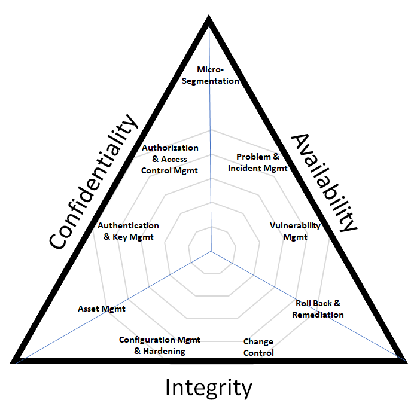

# 24AL733 - Connected Vehicles and Security 
   

## Introduction to Cryptography

### CIA Triad

- Confidentiality
- Integrity
- Availability

  

### Cryptographic Primitives
- Encryption/Decryption Algorithm
- Digital Signature Algorithm
- Cryptographic Hash Function
