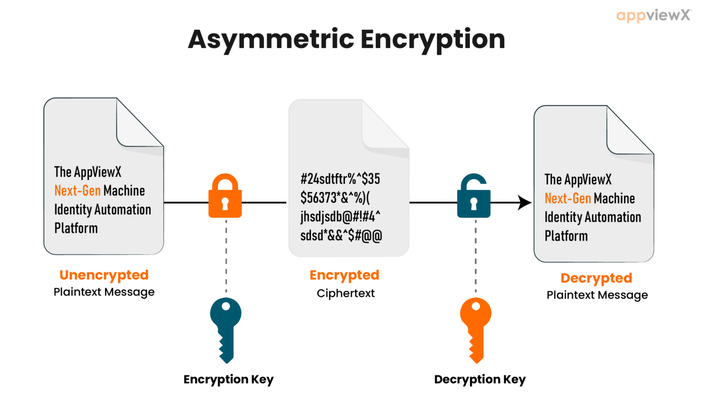
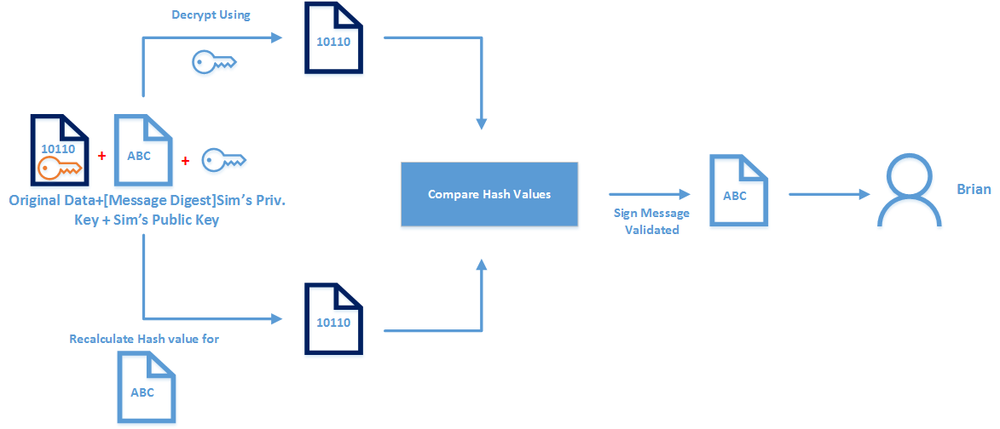

# 24AL733 - Connected Vehicles and Security 
   

## Encryption and Signature Algorithms

### Symmetric Key Encryption

  

#### Known Algorithms:
- Data Encryption Standard (DES)
- Triple DES (3DES)
- Advanced Encryption Standard (AES)
- 
### Asymmetric Key Encryption

  

#### Known Algorithms:
- RSA (Rivest–Shamir–Adleman)
- Diffie-Hellman Key Exchange
- Elliptic Curve Cryptography (ECC)
- ElGamal
- Digital Signature Algorithm (DSA)
  
[Click Here](https://cryptocalc.com.au/digital-signature-calc/) to understand RSA Signature

### Message Transmission Scenario

  

